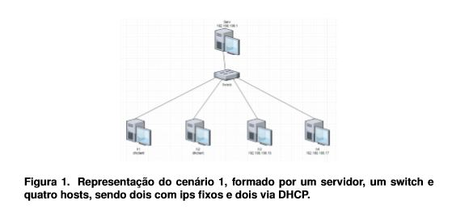
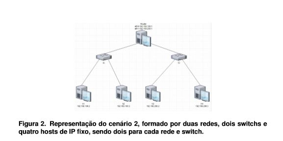

# Mininet_VM_APS

  A APS consiste em implementar através de stripts a simulação de dois cenários distintos de redes. Sendo o primeiro formado por um servidor conectado a um switch, este switch interliga quatro host, dois configurados com IP fixo e dois através do protocolo DHCP. Já o segundo cenário, é formado por duas redes executando em um mesmo roteador Linux, assim, teremos dois switchs (um para cada rede) e dois hosts para cada switch, todos estes hosts configurados com IP fixo. 

## Cenário 1
  

       
  

## Cenário 2
  

       
  

